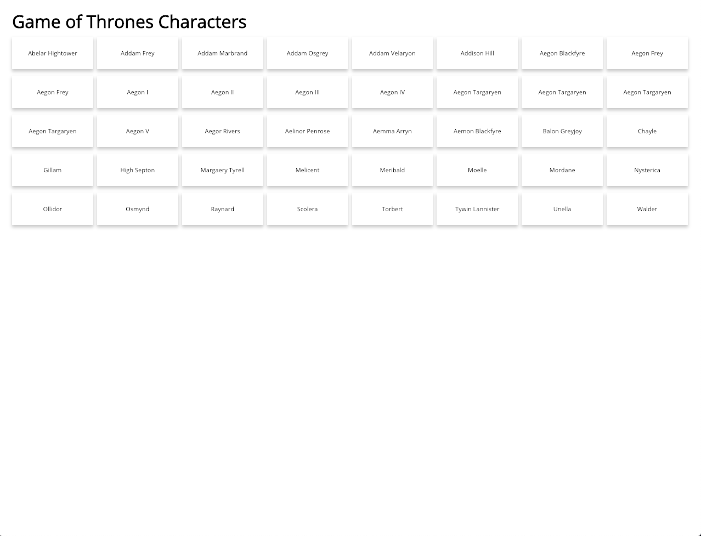
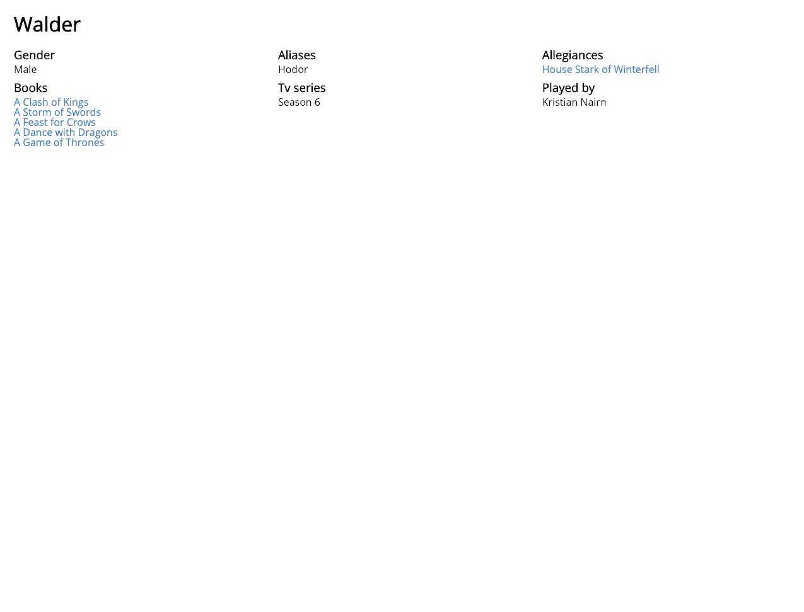
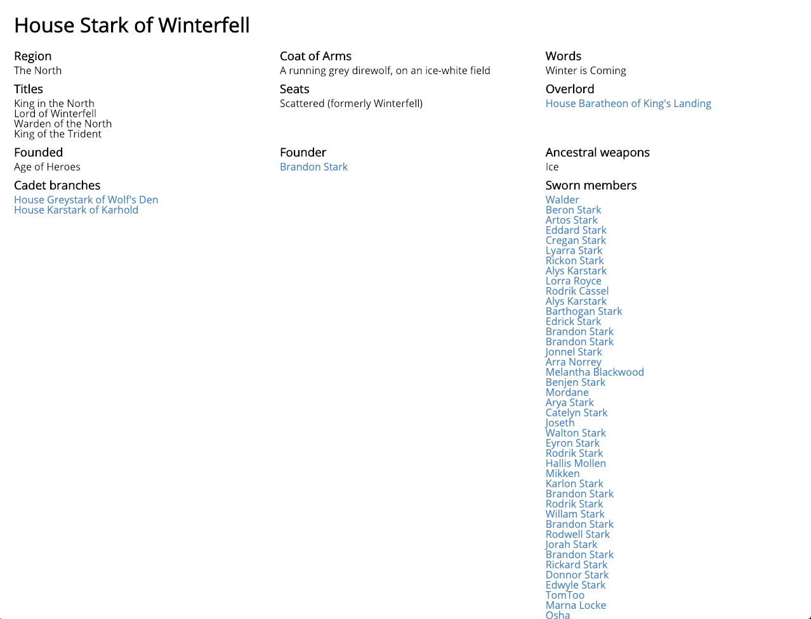
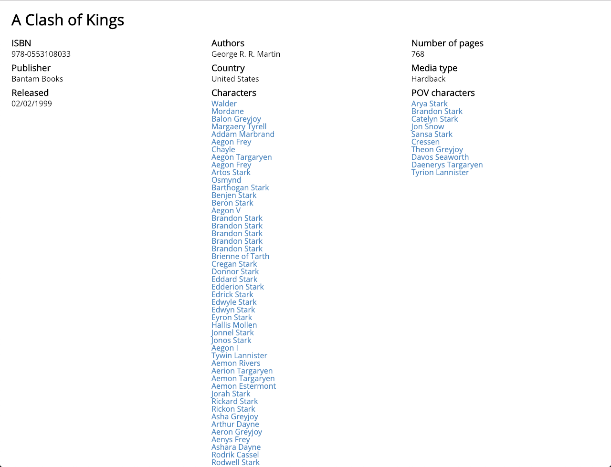

# Web App From Scratch - Game of Thrones

A Game of Thrones inspired application which allows the user to explore relations between characters, houses, books and more. It aims to let users learn more about Game of Thrones.

Characters overview page | Character detail page
:-------------------------:|:-------------------------:
 | 

House detail page | Book detail page
:-------------------------:|:-------------------------:
 | 

## Table of Contents

1. [Live demo](#live-demo)
2. [Installation](#installation)
    1. [Pre-install](#pre-install)
    2. [Install](#install)
3. [Interaction diagram](#interaction-diagram)
4. [Actor flow](#actor-flow)
5. [Features](#features)
6. [Technologies used](#technologies-used)
7. [Patterns](#patterns)
8. [Changelog](#changelog)
9. [Data sources](#data-sources)
10. [License](#license)

## Live demo

[Link](https://web-app-from-scratch.netlify.com/)

## Installation

### Pre-install

* Make sure to install [yarn](https://yarnpkg.com/en/) or [npm](https://www.npmjs.com).
* Make sure the **port** specified in the [package.json](package.json) is available (defaults to 3000).

### Install

* Clone the repository: `git clone git@github.com:Maikxx/web-app-from-scratch-18-19.git`.
* Navigate into the directory: `cd web-app-from-scratch-18-19`.
* Install dependencies: `yarn` or `npm install`.
* Start the client with: `yarn start-client` or `npm run start-client`.

To build the client run: `yarn build-client` or `npm run build-client`.

## Interaction diagram

## Actor flow

## Features

- [x] Render a list of characters from an api.
- [x] Enables routing from the list to the detail page of that character.
- [x] Enables routing from the detail page of a character to related detail pages (like books and siblings).
- [x] React like coding experience. 🕶️
- [x] Fully made in TypeScript with, where possible, good typings.
- [ ] A semi-decent looking application. 🙈
- [ ] A custom-made shadow-DOM and/or templating engine.
- [ ] Multiple apis.
- [ ] Loading states.

## Technologies used

* [Autoprefixer](https://www.npmjs.com/package/autoprefixer)
* [Babel polyfill](https://www.npmjs.com/package/babel-polyfill)
* [BabelJS](https://babeljs.io)
* [Concurrently](https://www.npmjs.com/package/concurrently)
* [Navigo](https://github.com/krasimir/navigo) - A router on which I based my initial [Router](./client/src/ts/utils/Router.ts), which I now no longer use, but just keep for when I might want to continue with this.
* [ParcelJS](https://parceljs.org)
* [TypeScript](https://www.typescriptlang.org)
* [Wait-on](https://www.npmjs.com/package/wait-on)
* [Yarn](https://yarnpkg.com/en/)

## Patterns

* Factories
* Private class data
* Observer

## Changelog

For a changelog, please refer to [this file](./docs/CHANGELOG.md).

## Data sources

* [apioffireandice](https://anapioficeandfire.com/) - A Game of Thrones api providing a lot of information about characters, books, houses and more. This API has no limits as to rates or authentication.

## License

This repository is licensed as [MIT](LICENSE) by [Maikel van Veen](https://github.com/maikxx).