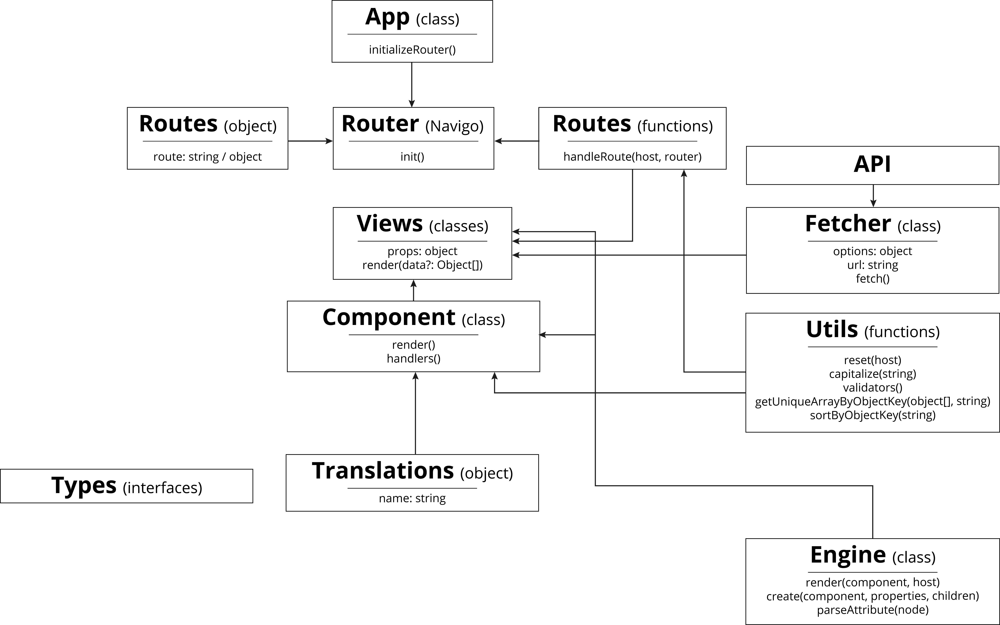
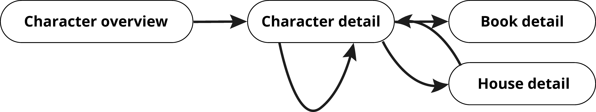
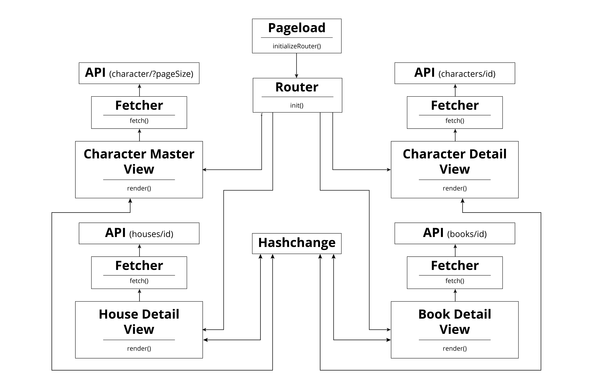

# Web App From Scratch - Game of Thrones

A Game of Thrones inspired application which allows the user to explore relations between characters, houses, books and more. It aims to let users learn more about Game of Thrones.

Characters overview page | Character detail page
:-------------------------:|:-------------------------:
 | 

House detail page | Book detail page
:-------------------------:|:-------------------------:
 | 

## Table of Contents

1. [Live demo](#live-demo)
2. [Installation](#installation)
    1. [Pre-install](#pre-install)
    2. [Install](#install)
3. [Actor flow](#actor-flow)
    1. [Version 1](#actor-flow-version-1)
    2. [Version 2](#actor-flow-version-2)
4. [Interaction diagram](#interaction-diagram)
    1. [Version 1](#interaction-diagram-version-1)
    2. [Version 2](#interaction-diagram-version-2)
5. [Features](#features)
6. [Technologies used](#technologies-used)
7. [Patterns](#patterns)
8. [Changelog](#changelog)
9. [Data sources](#data-sources)
10. [License](#license)

## Live demo

[Link](https://web-app-from-scratch.netlify.com/)

## Installation

### Pre-install

* Make sure to install [yarn](https://yarnpkg.com/en/) or [npm](https://www.npmjs.com).
* Make sure the **port** specified in the [package.json](package.json) is available (defaults to 3000).

### Install

* Clone the repository: `git clone git@github.com:Maikxx/web-app-from-scratch-18-19.git`.
* Navigate into the directory: `cd web-app-from-scratch-18-19`.
* Install dependencies: `yarn` or `npm install`.
* Start the client with: `yarn start-client` or `npm run start-client`.

To build the client run: `yarn build-client` or `npm run build-client`.

## Actor flow

### Actor flow version 1

    
Click here to see the first version

    

### Actor flow version 2

## Interaction diagram

### Interaction diagram version 1

    
Click here to see the first version

    

### Interaction diagram version 2

## Features

- [X] [A custom-made shadow-DOM and/or templating engine](./client/src/ts/utils/Engine.ts).
- [x] Enables [routing](./client/src/ts/App.ts) from the detail page of a character to related detail pages (like books and siblings).
- [x] Enables routing from the list to the detail page of that character.
- [x] Fully made in TypeScript with, where possible, good [typings](./client/src/ts/types).
- [X] [Loading states](./client/src/ts/utils/Engine.ts#64).
- [x] React like coding experience. 🕶️
- [x] Render a [list of data](./client/src/ts/components/Generic/DataList.ts) from an api.
- [ ] A semi-decent looking application. 🙈
- [ ] Multiple apis.

## Technologies used

* [Autoprefixer](https://www.npmjs.com/package/autoprefixer)
* [Babel polyfill](https://www.npmjs.com/package/babel-polyfill)
* [BabelJS](https://babeljs.io)
* [Concurrently](https://www.npmjs.com/package/concurrently)
* [Navigo](https://github.com/krasimir/navigo) - A router on which I based my initial [Router](./client/src/ts/utils/Router.ts), which I now no longer use, but just keep for when I might want to continue with this.
* [ParcelJS](https://parceljs.org)
* [TypeScript](https://www.typescriptlang.org)
* [Wait-on](https://www.npmjs.com/package/wait-on)
* [Yarn](https://yarnpkg.com/en/)

## Patterns

* Factories
* Private class data
* Observer

## Changelog

For a changelog, please refer to [this file](./docs/CHANGELOG.md).

## Data sources

* [apioffireandice](https://anapioficeandfire.com/)
    This is a Game of Thrones API providing a lot of information about Game of Thrones characters, books, houses and more.

    This API has no authentication, but has got a few limits:
    * Rate limit of 20000 requests made per day, per IP-address.
    * 50 requests per page maximum.
    * Is not zero-based.

## License

This repository is licensed as [MIT](LICENSE) by [Maikel van Veen](https://github.com/maikxx).