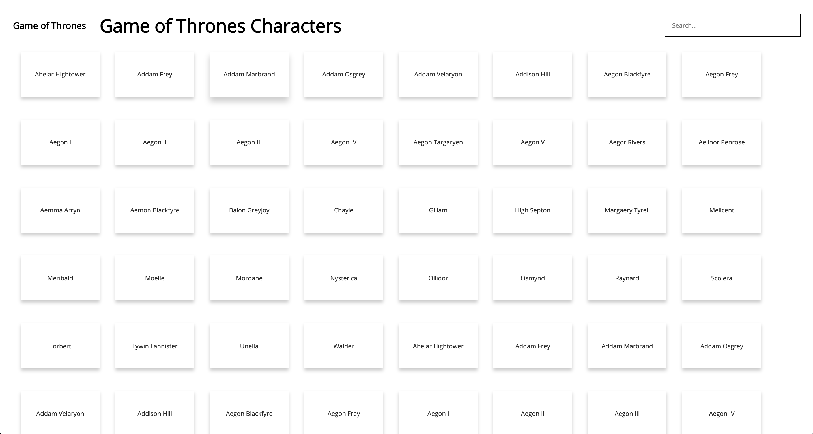
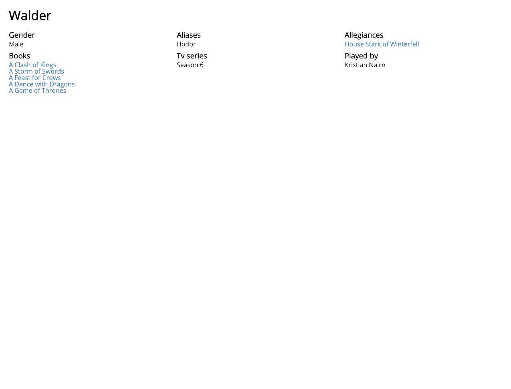
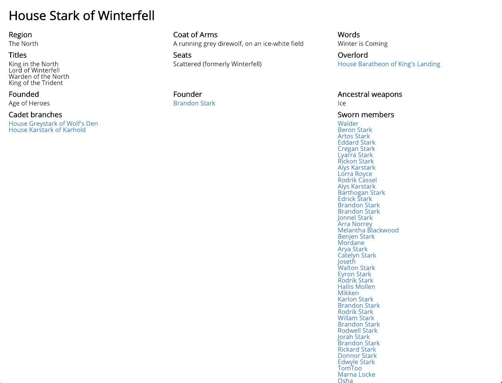
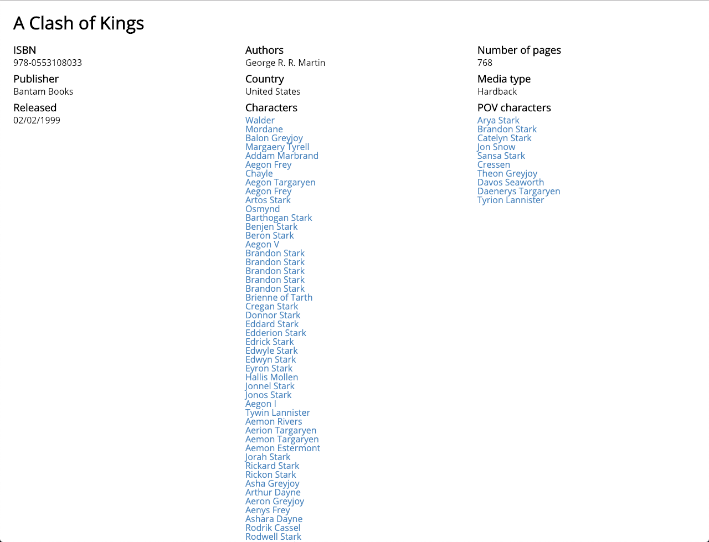
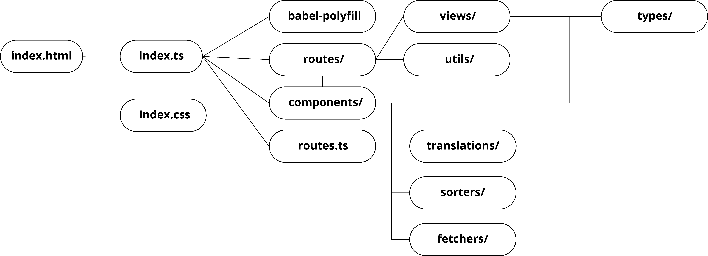
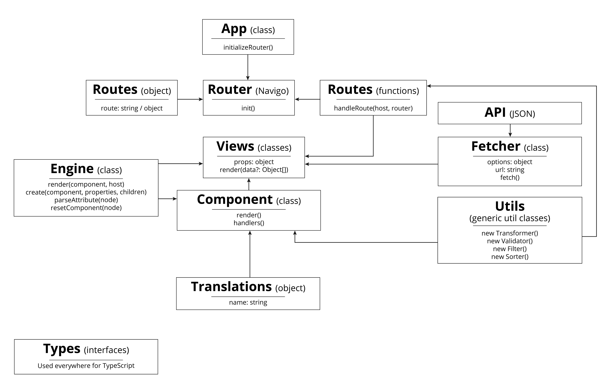
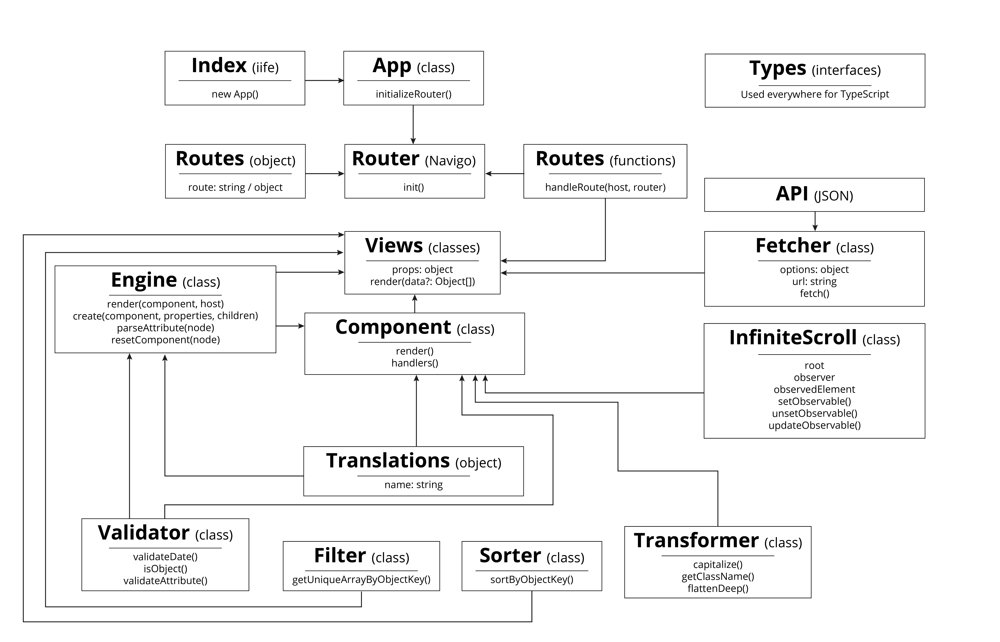
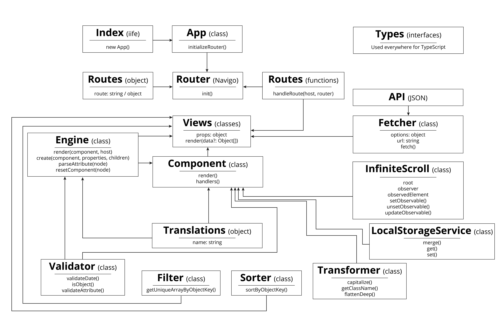
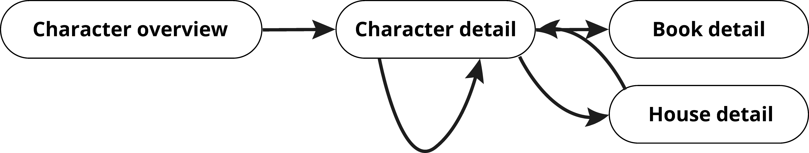
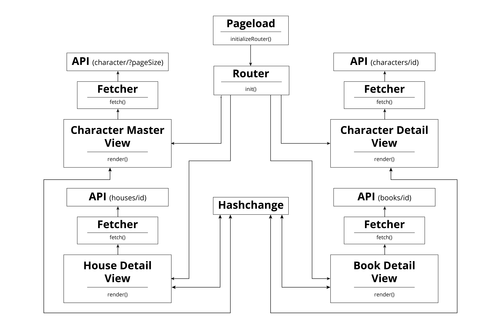

# Web App From Scratch - Game of Thrones

A Game of Thrones inspired application which allows the user to explore relations between characters, houses, books and more. It aims to let users learn more about Game of Thrones.

Characters overview page | Character detail page
:-------------------------:|:-------------------------:
 | 

House detail page | Book detail page
:-------------------------:|:-------------------------:
 | 

## Table of Contents

1. [Live demo 🚀](#live-demo)
2. [Installation](#installation)
    1. [Pre-install](#pre-install)
    2. [Install](#install)
3. [Actor flow](#actor-flow)
    1. [Version 1](#actor-flow-version-1)
    2. [Version 2](#actor-flow-version-2)
    2. [Version 3](#actor-flow-version-3)
4. [Interaction diagram](#interaction-diagram)
    1. [Version 1](#interaction-diagram-version-1)
    2. [Version 2](#interaction-diagram-version-2)
5. [Features 🔥](#features)
    1. [Features required by this course ✅](#features-required-by-this-course)
        1. [Week 1](#week-1)
        2. [Week 2](#week-2)
        3. [Week 3](#week-3)
    2. [Features beyond the scope of this course 🚀🌔](#features-beyond-the-scope-of-this-course)
6. [Technologies used 📦](#technologies-used)
7. [Patterns](#patterns)
8. [Changelog](#changelog)
9. [Data sources](#data-sources)
10. [License](#license)

## Live demo

[🚀  Link  🚀](https://web-app-from-scratch.netlify.com/)

## Installation

### Pre-install

* Make sure to install [yarn](https://yarnpkg.com/en/) or [npm](https://www.npmjs.com).
* Make sure the **port** specified in the [package.json](package.json) is available (defaults to 3000).

### Install

* Clone the repository: `git clone git@github.com:Maikxx/web-app-from-scratch-18-19.git`.
* Navigate into the directory: `cd web-app-from-scratch-18-19`.
* Install dependencies: `yarn` or `npm install`.
* Start the client with: `yarn start-client` or `npm run start-client`.

To build the client run: `yarn build-client` or `npm run build-client`.

## Actor flow

### Actor flow version 1

    
Click here to see the first version

    

### Actor flow version 2

    
Click here to see the second version

    

### Actor flow version 3

    
Click here to see the third version

    

### Actor flow version 4

## Interaction diagram

### Interaction diagram version 1

    
Click here to see the first version

    

### Interaction diagram version 2

## Features

### Features required by this course

#### Week 1

- [X] Used the (boilerplate) of the [repository of this course](https://github.com/cmda-minor-web/web-app-from-scratch-1819) as a base for this repository.
- [X] A good README document.
- [X] [Load data from an API asynchronous](./client/src/ts/utils/Fetcher.ts).
- [X] Render a [list of data](./client/src/ts/components/Generic/DataList.ts) from an API 🐒.
- [X] Created multiple issues in the repository of [Chelsea Doeleman](https://github.com/chelseadoeleman/web-app-from-scratch-18-19) and generally helped a lot of people during this course.

#### Week 2

- [X] Create an actor diagram.
- [X] Create an interaction diagram.
- [X] Refactor code, just take a gander at the amount of [commits](https://github.com/Maikxx/web-app-from-scratch-18-19/commits/master) I made with the prefix `refactor`.
- [X] [Routing](./client/src/ts/App.ts) between pages.
- [X] Implement or build a template engine (take a look at the next section).

#### Week 3

- [X] Manipulate data from the API, [transformer](./client/src/ts/utils/Transformer.ts), [filter](./client/src/ts/utils/Filter.ts), [sorter](./client/src/ts/utils/Sorter.ts), [data-translations](./client/src/ts/translations/translatedTypes.ts).
- [X] [Loading states](./client/src/ts/utils/Engine.ts#72).
- [X] Code splitting was setup from the start.

### Features beyond the scope of this course

- [X] [A custom shadow-DOM / templating engine](./client/src/ts/utils/Engine.ts).
- [X] Ability to search in the API.
- [X] A React like development experience. 🕶️
- [X] [Filter attributes and properties passed to the engine based on existence](./client/src/ts/utils/Engine.ts#62).
- [X] Fully written in [TypeScript](https://www.typescriptlang.org).
- [X] [Pagination](./client/src/ts/utils/InfiniteScroll.ts).
- [X] Set up using a [build tool](https://parceljs.org).
- [X] Data persistence on detail pages on revisit. (Data persistence on the paginated [master view](./client/src/ts/views/CharacterMasterView.ts) is another beast that is way more difficult, hence not included yet.)

## Technologies used

* [Autoprefixer](https://www.npmjs.com/package/autoprefixer).
* [Babel polyfill](https://www.npmjs.com/package/babel-polyfill).
* [BabelJS](https://babeljs.io).
* [Concurrently](https://www.npmjs.com/package/concurrently).
* [Navigo](https://github.com/krasimir/navigo) - A router on which I based my initial [Router](./client/src/ts/utils/Router.ts), which I now no longer use, but just keep for when I might want to continue with this.
* [ParcelJS](https://parceljs.org).
* [TypeScript](https://www.typescriptlang.org).
* [Wait-on](https://www.npmjs.com/package/wait-on).
* [Yarn](https://yarnpkg.com/en/).

## Patterns

* The [constructor pattern](https://addyosmani.com/resources/essentialjsdesignpatterns/book/#constructorpatternjavascript) can be found throughout the application to instantiate from a JavaScript class.
* The [module pattern](https://addyosmani.com/resources/essentialjsdesignpatterns/book/#modulepatternjavascript) can be found throughout the application to structure the TypeScript code and to prevent leakage of globals.
* The [private class data](https://en.wikipedia.org/wiki/Private_class_data_pattern) is used across the application to prevent instances of classes from accessing these properties and methods.
* The [composite pattern](https://addyosmani.com/resources/essentialjsdesignpatterns/book/#compositepatternjquery) is used to extends the base [Component](./client/src/ts/utils/Component.ts) class in the [Engine](./client/src/ts/utils/Engine.ts) I wrote.

## Changelog

For a changelog, please refer to [this file](./docs/CHANGELOG.md).

## Data sources

* [APIOfFireAndIce](https://anapioficeandfire.com/)
    This is a Game of Thrones API providing a lot of information about Game of Thrones characters, books, houses and more.

    This API does not require authentication, but has got a few limits:
    * Rate limit of 20000 requests made per day, per IP-address.
    * 50 requests per page maximum.
    * Is not zero-based.

## License

This repository is licensed as [MIT](LICENSE) by [Maikel van Veen](https://github.com/maikxx).